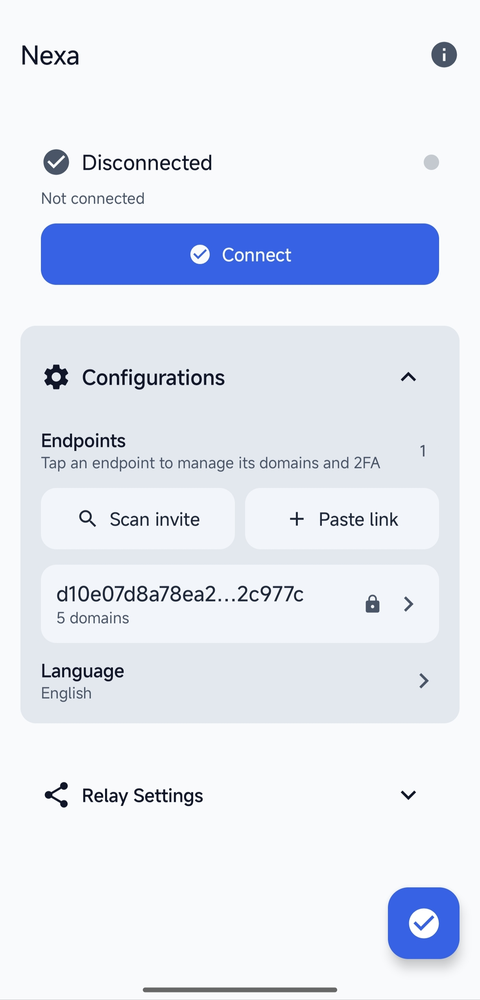
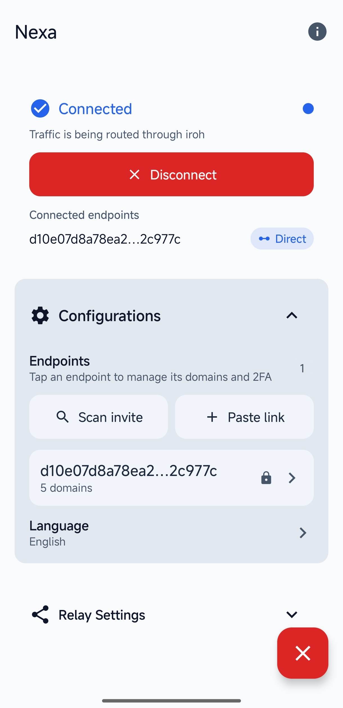
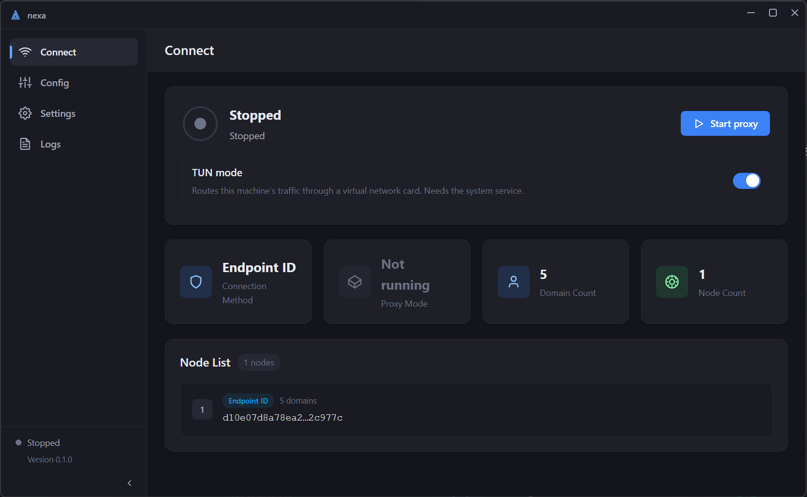
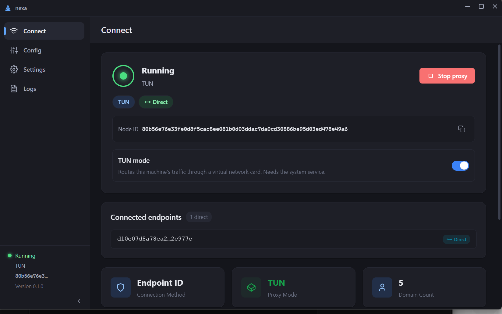

<p align="right">
  English · <a href="README.zh-CN.md">简体中文</a>
</p>

# NexaPipe

Expose HTTP, HTTPS, WebSocket, TCP and UDP services that live behind NAT through
a single [iroh](https://github.com/n0-computer/iroh) endpoint — **without ever
holding a certificate, without a control plane, and without a server to rent.**

Put plainly: **the proxy is a pipe, not a party.** It cannot read what it
carries, it is not an account you have to trust, and it does not rent anyone's
machine. See [Why NexaPipe](#why-nexapipe) for what that costs you.

NexaPipe is a Rust workspace with four parts:

- **`nexapipe`** — the server: an L7 reverse proxy plus an L4 tunnel that accept
  traffic over iroh/QUIC and forward it to your real backends. It can also serve
  plain HTTP directly. TLS is not terminated here — it is passed through to the
  backend, which owns the certificates.
- **`nexapipe-client`** — the client library: connection pooling, domain-to-node
  routing, a local HTTP proxy, and a smoltcp-based TUN proxy. Shipped as an
  `rlib`, a `cdylib` (Android JNI) and a UniFFI binding.
- **`nexapipe-proto`** — the wire format of the L4 tunnel: the `0x05` preface,
  the status byte, and UDP framing. Dependency-free, used by both sides so they
  cannot disagree about it.
- **Apps** — an Android client (`ui-android`, TUN/VpnService) and a desktop
  client (`ui-desktop`, Tauri 2 + Vue 3), both part of this repository
  (imported with their full git history from their former standalone repos).

[How it works](#how-it-works) · [Why NexaPipe](#why-nexapipe) ·
[Embed it](#embed-it-in-your-app) · [Layout](#repository-layout) ·
[Quick start](#quick-start-server) · [CLI](#cli) ·
[Configuration](#configuration) · [Minimal config](#minimal-config) ·
[TLS](#tls) · [TCP & UDP](#tcp--udp) ·
[2FA](#2fa-totp) · [Endpoint invites](#endpoint-invites) ·
[Security](#security-boundary) ·
[Client library](#using-the-client-library) · [Apps](#client-apps) ·
[Development](#development) · [Contributing](CONTRIBUTING.md) ·
[Roadmap](docs/ROADMAP.md) · [Changelog](CHANGELOG.md) ·
[v0.4.0 notes](https://open-nexa.github.io/nexapipe/v0.4.0.html)

---

## How it works

```
   clients                       nexapipe server                    your LAN / host
   ───────                       ───────────────                    ───────────────
   any HTTP client  ── TLS ───►  passthrough by SNI      ── TCP ──►  Caddy :443 (certs)
   nexapipe-client  ── QUIC ──►  L7 router (Host + path) ── HTTP ──► backend A  backend B
   (local proxy / TUN)           L4 tunnel (tcp / udp)               :18080  :15432  :3478
```

One inner TCP connection maps to one QUIC bidirectional stream. What it carries
depends on who opened it: an HTTP request (or a WebSocket upgrade), a TLS
session, or an L4 flow — a raw TCP connection or a UDP flow. For HTTP the server
routes by `Host` exactly like an ordinary reverse proxy — the NAT traversal
happens underneath and is invisible to both the app and the backend.

The **first byte** of a stream picks the handler, so the four kinds of traffic
never have to be told apart by guessing:

| First byte | Handler | Section |
| --- | --- | --- |
| `0x16` | TLS `ClientHello` → routed by SNI, forwarded as bytes | [TLS](#tls) |
| `0x05` | L4 preface → raw TCP or UDP to a named backend | [TCP & UDP](#tcp--udp) |
| anything else | HTTP request | this page |

---

## Why NexaPipe

Three properties, and what each one costs, because none of them is free.

- **It never terminates TLS.** A `ClientHello` is matched by SNI and copied
  through as bytes, so the session runs end to end between the visitor and your
  backend. What that costs: an opaque pipe cannot rewrite paths, cannot decide on
  the request, cannot probe `/health`, and its access log records bytes rather
  than a request line. (`mode = "http"` is the exception — there the proxy does
  parse the request. See [Security boundary](#security-boundary).)
- **There is no control plane.** One binary and one `config.toml`; no account, no
  coordination server, no third party holding a map of your nodes. What that
  costs: no central device list, no remote revocation, no SSO — adding a client
  means editing the config, which the running server picks up within seconds.
- **There is nothing to rent.** Clients hole-punch straight to your endpoint over
  QUIC. What that costs: hole punching succeeds for roughly 90–95% of
  connections and the rest fall back to a relay, so for anything you depend on
  you should run your own — and once you are maintaining a public machine anyway,
  "no server to rent" stops being much of an advantage.

When not to use it:

- **Your visitors cannot install anything** — NexaPipe needs a client; a hosted
  tunnel serves a plain URL to any browser.
- **You need SSO, ACLs and an audit trail** — NexaPipe authenticates a client and
  then serves every route it has.
- **A relayed connection is unacceptable** — use something with a permanent
  middle machine.

---

## Embed it in your app

The client is a library, so your own app can reach a private network without
shelling out to anything — as an `rlib`, a `cdylib` for Android JNI, and UniFFI
bindings for Swift/Kotlin/Python. See
[Using the client library](#using-the-client-library).

---

## Repository layout

| Path | What it is |
| --- | --- |
| `crates/nexapipe/` | Server binary and library: CLI (`src/main.rs`), config, iroh stream handling (`src/conn/`), HTTP/WebSocket proxying (`src/http/`, `src/proxy/`), TLS passthrough, the L4 tunnel (`src/l4/`), routing (`src/routes/`, `src/lb/`), health checks, TOTP 2FA (`src/auth/`). |
| `crates/nexapipe-client/` | Client library (`lib` + `cdylib`): pool, domain→node mapping, local proxy, L4 client, smoltcp TUN proxy, QUIC tuning, JNI, UniFFI. |
| `crates/nexapipe-proto/` | The L4 wire format: `preface.rs` and `udp.rs`. No dependencies, so both sides link the same code. |
| `third_party/smoltcp` | Vendored smoltcp 0.12 with a patch for the sequence-number underflow panic. Wired in through `[patch.crates-io]`. Do not edit. |
| `ui-android/` | Android app (Kotlin + Compose). |
| `ui-desktop/` | Tauri 2 desktop app (Vue 3 + TypeScript). |
| `config.toml.example` | Example server + client configuration covering every section (2FA off). Copy it to `config.toml` — that name is gitignored, it is the operator's live config. |
| `config.toml.2fa.example` | The same, with 2FA enabled and a `[auth.clients]` entry. |
| `run_android.ps1` | One-shot Android debug loop (build → install → launch → logcat). |

---

## Quick start (server)

```bash
cargo build --release -p nexapipe

cat > config.toml <<'EOF'               # config.toml is gitignored; this is a whole server config
[[routes]]
host_pattern = "*"
backends = ["http://127.0.0.1:3000"]    # the service you want to expose
EOF

cargo run -p nexapipe -- --config config.toml
```

Three lines is a working server: one catch-all route, one backend, every other key
left at its default. The client side is the same length — see
[Minimal config](#minimal-config), which also lists what each omitted key
defaults to. Start from `config.toml.example` instead when you want every
section written out, or `config.toml.2fa.example` when you want 2FA on.

On startup the server prints what clients need:

```
========================================
Proxy Connection Information
========================================
Node ID (stable, for server_node_id): 2f9c...
Ticket (for clients):                 endpoint:...
========================================
```

Give clients either the **Node ID** (stable, but it needs discovery) or the
**Ticket** (carries addresses, so it changes when they do). Set
`[iroh] secret_key` to keep the Node ID stable across restarts — and with it
everything the Node ID is used for. A ticket is a different matter: it embeds
the addresses it was printed with, so a `secret_key` does not stop it going
stale, and it has to be regenerated when the endpoint moves.

```bash
cargo run -p nexapipe -- --generate-secret
```

### Docker

```bash
mkdir -p config && cp config.toml.example config/config.toml   # config.toml is gitignored
docker compose up -d --build
docker compose exec nexapipe tail -f /app/logs/nexapipe.log
```

`docker-compose.yaml` mounts a `config/` directory — the one holding your
`config.toml` — and a `logs/` volume, and points `NEXAPIPE_LOG_DIR` at it.
`host.docker.internal` is configured, so backends running on the Docker host are
reachable. Moving an existing deployment over is one command:
`mkdir -p config && mv config.toml config/config.toml`.

Published images are on GHCR (`linux/amd64` and `linux/arm64`), so the build step
is optional: `docker pull ghcr.io/open-nexa/nexapipe:latest`.

#### Editing the config file

The file is re-read every 5 seconds, so an edit needs no restart — but **run
anything that writes it inside the container**:

```bash
# The image's own binary, against the file the server is actually reading.
docker compose exec nexapipe /usr/local/bin/nexapipe \
    --config /app/config/config.toml --generate-invite client-001 --registration
```

Running the same command on the host against the bind-mounted file is where it
goes wrong:

- **Keep the mount a directory.** A single-file bind mount is pinned to the
  inode the path had when the container started, so anything that replaces the
  file — `sed -i`, an editor with atomic save, `mv` — leaves the container
  reading the copy that was swapped out: the change never arrives and nothing is
  logged. `docker compose restart` does not help, because it does not rebuild
  the mount; `docker compose up -d --force-recreate` does. The compose file
  mounts `./config:/app/config` for exactly this reason — a directory mount is
  resolved by name on every lookup, so it always sees the current file. Putting
  `./config.toml:/app/config/config.toml` back reintroduces the trap.
- **Two writers, no lock.** The server rewrites the whole file to persist the
  `failed_attempts` / `locked_until` / `last_used` counters whenever a 2FA
  attempt happens (`save_auth_state`). Every write on both sides is a
  read-modify-write with no locking, so an overlapping host edit and flush lose
  one of them. A `pending_enrollment` token is the worst case: the server never
  writes it back, so losing the race costs you the invite and prints nothing.
- **The host binary is not the server's binary.** `--generate-invite` derives the
  endpoint from `[iroh] secret_key`, so a host copy of the config without that
  key — or a `nexapipe` built from another commit — issues an invite pointing at
  an endpoint nobody is running.
- **Mode and ownership change under you.** A rewrite from the host can land the
  file at `0644` or with a different owner. A config holding a credential is then
  refused at startup, and a reload cannot turn 2FA on until it is `0600` again.

The mount is read-write on purpose: the server writes the 2FA counters back into
the file, so a `:ro` mount would cost a lockout its persistence and log an error
on every attempt.

Editing with an editor is fine as long as it saves in place — the default for
`vim` and for a shell `>` redirect. Whatever you changed, confirm the server
took it instead of assuming it did:

```bash
docker compose logs -f --tail=50 nexapipe | grep -i reload
# Detected config change, reloading...  →  Config reloaded: 3 routes now live
# Config not reloaded, keeping the current routes: ... → refused, old routes still serve
```

---

## CLI

| Flag | Meaning |
| --- | --- |
| `-c, --config <PATH>` | Config file (default `config.toml`). |
| `--local-proxy` | Run as a client-side local HTTP proxy instead of a server. |
| `--generate-secret` | Print a new iroh secret key for a stable endpoint identity. |
| `--generate-2fa <CLIENT_ID>` | Generate a TOTP secret, write it to the config and print the enrollment QR code. |
| `--force` | With `--generate-2fa`: rotate an existing client's secret. |
| `--show-2fa <CLIENT_ID>` | Print the QR code of a client already in `[auth.clients]`. |
| `--issuer <NAME>` | Issuer label shown by the authenticator app. |
| `--qr-format <FMT>` | `unicode` (default), `plain`, `ascii`, `svg`, `none`. |
| `--qr-invert` | Draw the QR code inverted (light on dark). |
| `--qr-out <PATH>` | Also write the QR code to a file (`.svg` → SVG, anything else → ASCII). |
| `--generate-invite [CLIENT_ID]` | Print a scannable `nexapipe://` invite. With a `CLIENT_ID` it carries the 2FA secret too; without one, only endpoint and domains. |
| `--registration` | With `--generate-invite CLIENT_ID`: put a one-time enrollment token in the link instead of the secret. |
| `--create-client` | With `--generate-invite CLIENT_ID`: create the client if it does not exist yet, generating and writing its secret in the same run. |
| `--invite-domains <LIST>` | Domains to put in the invite, comma-separated (default: `[local_proxy] proxy_domains`, else the route hosts). |
| `--invite-name <NAME>` | Label stored alongside the endpoint. |
| `--invite-relay <URL>` | Relay URL in the invite (default: `[iroh] relay_url`). |
| `--endpoint-id <NODE_ID>` | Endpoint to publish (default: derived from `[iroh] secret_key`). |

---

## Configuration

`config.toml` is the single source of truth for both the server and client mode.
Every key is optional.

The file is re-read every 5 seconds and applied live: `[[routes]]` and the
`[auth.clients]` table need no restart, and a config
that fails to parse or validate is reported and ignored, so a half-saved edit
cannot take the proxy down. The rest is read once at startup and needs a restart:
`[server] listen_addr`, `[iroh]`, `[peers]`, the `[auth]` TOTP parameters and
`[log]`.

An `[auth]` section can appear where there was none, too: a server started
without one still picks up its `clients` — and `enabled = true` — from a later
reload, so enabling 2FA for the first time does not need a restart.

Two changes are deliberately one-way on a running server: `[auth] enabled = true`
is picked up by the watcher, but turning 2FA *off* is refused (restart to
disable it), and `enabled = true` together with an exposed plaintext listener is
refused outright.

### Minimal config

A whole **server** — one catch-all `http` route to one backend:

```toml
[[routes]]
host_pattern = "*"
backends = ["http://127.0.0.1:3000"]
```

A whole **client** (`nexapipe --local-proxy`), turning `127.0.0.1:8081` into an
HTTP proxy that tunnels the listed domains:

```toml
[local_proxy]
enabled = true
listen_addr = "127.0.0.1:8081"
proxy_domains = ["app.example.com"]

[[local_proxy.nodes]]
server_node_id = "<the Node ID the server printed>"
domains = ["app.example.com"]
```

What the short forms leave out, and what you get instead:

| Omitted | You get |
| --- | --- |
| `[server] listen_addr` | no plaintext listener — traffic comes in over iroh only |
| `[iroh] secret_key` | a fresh Node ID on every restart; add one (`--generate-secret`) when clients should not lose track of the server |
| `[iroh] relay_mode` | `default`: N0 relays, home relay picked by latency |
| `mode` | `http` |
| `path_pattern` | `/`, prefix match |
| `strategy` | `round_robin` (or `random`, or `least_conn` — fewest requests outstanding to that backend) |
| `[health_check]` | enabled: `GET {backend}/health` every 10 s. A backend with no such endpoint is logged as failing, but **traffic still flows to a route with one backend** — there is nothing to choose between — so that is log noise, not an outage. A route with several, all down, answers 503 without dialling. Set `enabled = false` to silence it. |
| `[log]` | rotating files under `./logs` plus console output, query values redacted |
| `[auth]`, `[peers]` | no authentication — the server prints a warning banner at startup. Fine on a laptop; add `[peers] allow` (or 2FA) before this faces anything you care about. |

Everything below this section is optional. Two keys are not: a route needs
`host_pattern` and `backends`, and a `[local_proxy]` block needs `listen_addr`
and `proxy_domains`.

### Top level

`debug` (default `false`) turns on debug logging.

**There is no fallback.** A host no route names is answered 404 over HTTP, and
refused outright by `passthrough`, `tcp` and `udp` lookups. "Send everything
here" is spelled as a catch-all route — `host_pattern = "*"` — which is
load-balanced and health-checked like any other route. The old top-level
`default_backend` has been **removed**: a config that still names it is refused
at startup rather than silently ignored, so an existing config cannot quietly
start answering 404 where it used to forward.

A wildcard has to be `*` on its own or start with `*.`: the dot is what marks
the label boundary, and without it `*.example.com` would also match
`notexample.com` — a host that merely ends in the same letters and belongs to
somebody else. A pattern like `*example.com` is refused at startup, in
`host_pattern` and in a client's `allow_hosts` alike.

### `[server]` — direct ingress (off by default)

| Key | Default | Notes |
| --- | --- | --- |
| `listen_addr` | *unset — not bound* | Plain HTTP listener. A TLS session opened against it is passed through, not terminated. |
| `expose` | `false` | Required for `listen_addr` to name anything but loopback. Refused at startup while `[auth] enabled = true`. |

**Nothing on this listener is authenticated**: the 2FA handshake runs in the iroh
accept loop, so a request arriving here reaches a route without ever being asked
for a credential. Leave `listen_addr` unset (the default) or keep it on
`127.0.0.1` for something on the same host; a non-loopback bind additionally
needs `expose = true` and publishes every `http` route and every `passthrough`
backend to whoever can reach the port. `expose = true` together with
`[auth] enabled = true` is **refused at startup** — with 2FA on, the combination
reads as a protected proxy but is not one. (Older versions logged a warning and
started anyway.)

One difference from the tunnel path: **WebSocket upgrades are proxied over iroh
but answered `426 Upgrade Required` here** — the listener has no WebSocket
client. Clients that need WebSocket must come through the tunnel.

`tls_enabled`, `tls_listen_addr`, `cert_path` and `key_path` are still accepted
so an existing `config.toml` parses, but they do nothing and are reported at
startup — delete them and see [TLS](#tls).

### `[iroh]` — the tunnel endpoint

| Key | Notes |
| --- | --- |
| `secret_key` | Hex secret key from `--generate-secret`; keeps the Node ID stable. |
| `bind_port` | Fixed UDP port instead of an ephemeral one. |
| `bind_ipv6` | Also bind `[::]` on that port, so the endpoint answers over IPv6. The IPv4 socket stays — this adds one, it does not replace one — and the IPv6 bind is allowed to fail, so a host without IPv6 still starts. Ignored without `bind_port`. |
| `relay_mode` | `pinned` / `default` / `disabled` / `custom`. Absent means `default`. |
| `relay_url` | The relay to use with `relay_mode = "custom"`; setting it without a `relay_mode` means `custom`. |
| `relay_auth_token` | Optional bearer token for a `custom` relay that requires one. |

Relay modes:

- **`default`** — every N0 relay, home relay chosen by latency. It can migrate
  between relays, which drops the connections routed through it.
- **`pinned`** — one fixed N0 relay (`aps1-1`, Singapore). Use when relay
  migration is worse than a slightly slower relay.
- **`disabled`** — no relay transport at all. Stronger than it sounds: you also
  cannot dial a peer through *its* relay.
- **`custom`** — one relay you run, and only that one: no N0 relay is used,
  neither as a home relay nor as a probe target. Pointing it at an
  `*.relay.n0.iroh.link` URL is rejected; use `pinned` or `default` for those.

A `relay_mode` that is present but unusable — `custom` with no URL, an
unrecognised spelling — stops startup instead of quietly falling back. A
`relay_url` next to a mode that does not take one is ignored and logged.

**What no `relay_mode` changes:** Endpoint ID discovery still queries
`dns.iroh.link`, and `custom` constrains this endpoint only — a peer advertising
an N0 relay is still dialled through it. Discovery has no switch NexaPipe
exposes, though iroh 1.2.0 itself has `clear_address_lookup()`.
[What still depends on third-party infrastructure](docs/iroh-boundaries.md)
states the boundary in full, including what `custom` does and does not buy.

### `[[routes]]` — routing

```toml
[[routes]]
host_pattern = "comfyui.example.com"
path_pattern = "/"
path_is_prefix = true
strategy = "round_robin"          # or "random" or "least_conn"
backends = ["http://192.0.2.20:18188"]
mode = "http"                     # default
# path_rewrite = "/api"

[[routes]]
host_pattern = "app.example.com"
mode = "passthrough"              # TLS, routed by SNI; see TLS below
backends = ["caddy:443"]

[[routes]]
host_pattern = "db.example.com"   # a raw TCP service, any port
mode = "tcp"
backends = ["192.0.2.30:15432"]

[[routes]]
host_pattern = "turn.example.com"
mode = "udp"                      # UDP flows, idle timeout in seconds
backends = ["192.0.2.40:13478"]
idle_timeout_secs = 60

# One host that has to answer both a request and a tunnel — the ordinary shape
# for an Android TUN client. `modes` takes several; `mode` takes one.
[[routes]]
host_pattern = "app.example.com"
modes = ["http", "tcp"]
backends = ["http://host.docker.internal:18080"]
```

| Mode | What it does | Transport security |
| --- | --- | --- |
| `http` (default) | Parses the request, applies `path_pattern` / `path_rewrite`, and re-issues it with the shared HTTP client. Backends must be `http://` — an `https://` backend is rejected at startup. | Encrypted on the way in (QUIC; plain HTTP when it arrives on `listen_addr`) but **plain HTTP from the server to the backend**. Anything sensitive belongs on a `passthrough` route, or on a `tcp` route whose payload carries its own TLS. |
| `passthrough` | Copies bytes. The route is selected by SNI, so `path_pattern` and `path_rewrite` do not apply and the backend may be a bare `host:port`. | End to end: the bytes are TLS and the server never terminates them, so the client validates the backend's own certificate. See [TLS](#tls). |
| `tcp` | Carries a raw TCP flow to `backends`, selected by the host name in the L4 preface. No HTTP parsing, no `path_pattern`, no health check. See [TCP & UDP](#tcp--udp). | QUIC-encrypted up to the server; from there it is the tunnelled protocol verbatim — TLS, SSH or anything else is yours to bring. |
| `udp` | Carries UDP flows — one QUIC bi-stream per flow, one datagram per frame. Same selection as `tcp`, plus `idle_timeout_secs`. | QUIC-encrypted up to the server; payload security is the tunnelled protocol's job (DTLS, WireGuard, …). |

No mode terminates TLS for a backend: the hop from the server to `backends` is as
encrypted as what you put on the wire, and only `passthrough` keeps the client's
TLS session intact all the way there.

A route serves **one** mode with `mode = "..."` and **several** with
`modes = [...]`; they may be written together and the route serves the union,
with duplicates collapsed. Which one a *connection* uses is still decided by its
first byte, so one connection only ever takes one path.

The cost of sharing one `backends` list is that the address has to satisfy every
declared mode, and the L4 rules are stricter: **the port must be written out**
(`http://host` is fine for `http` alone, where 80 is implied, and rejected once
`tcp` is added). A route has exactly one pool, so write two entries when the
modes need different backends.

Removed route keys, still parsed but ignored and reported at startup:
`cert_path`, `key_path`, `redirect_to_https`.

### `[health_check]` — probing `http` backends

```toml
[health_check]
enabled = true     # default: true — set false when no backend answers a probe
interval = 10      # seconds between two rounds of checks
timeout = 5        # seconds before one check is abandoned
threshold = 3      # consecutive failures before a backend leaves the pool
path = "/health"   # appended to the backend URL
```

Each `mode = "http"` backend is probed with `GET {backend}{path}` and leaves the
pool after `threshold` *consecutive* failures — one lost probe never empties it —
returning on the first probe that succeeds. `passthrough`, `tcp` and `udp` routes
are never probed: a TLS listener and a database cannot answer an HTTP request.

**Set `enabled = false` when your backends cannot answer a health endpoint** — a
static file server, a device's admin UI. Every backend then stays in the pool and
traffic is simply forwarded. `enabled` is live: a reload pauses the checks that
are already running. The other four keys are read when a checker starts, so
changing them takes effect on restart or for routes added by a reload.

`interval`, `timeout` and `threshold` must each be at least `1`: `0` used to be
clamped silently, and each of the three then meant something nobody would ask for
— a probe round every second, a probe that can never finish, or a single failure
emptying the pool. A config that says `0` is refused at load.

### `[timeouts]` — waiting on a backend

```toml
[timeouts]
connect_secs = 10     # default: 10 — dialing a backend
response_secs = 30    # default: 30 — waiting for its answer
```

Both are seconds, both are optional, and the defaults are the deadlines this
server always used, so writing the section changes nothing until you put a number
in it. Neither one bounds how long a request may take: each covers **one step of
talking to a backend**, and once a response head arrives, streaming its body can
run as long as it needs to.

| key | covers | raise it when |
|---|---|---|
| `connect_secs` | dialing. Every path that opens one connection toward one backend: HTTP requests (including the WebSocket upgrade), TLS passthrough and `tcp` tunnels. | the backend is across a slow or lossy link — too short a value there fails every request, and it fails looking like an outage. |
| `response_secs` | waiting for the backend's answer: the status line, or for a WebSocket, the upgrade response. Ends as soon as the head arrives. | an API computes before it answers. A backend that never answers at all is what it limits. |

`0` is refused at load, and so is anything past `3600`: the first is a deadline no
backend can meet, and the second is not a slow backend but one that has stopped
answering, with nothing left holding the request slot.

Waits on the **client's** own bytes are deliberately not here — the L4 preface,
the TLS `ClientHello`, the first byte on the plaintext listener. Those are
protocol mechanics, not "how patient should I be with this backend".

Read once at startup, so editing either takes a restart.

### `[admin]` — the auxiliary listener (off by default)

```toml
[admin]
listen_addr = "127.0.0.1:9090"   # absent => the listener is not bound at all

[metrics]
enabled = true                   # serves /metrics on it; default: false
```

A second listener that answers questions about **this instance** instead of
forwarding traffic:

| Path | Auth | Purpose |
|---|---|---|
| `GET /healthz` | none | `200 ok` for as long as the process is serving. |
| `GET /metrics` | none | Instance metrics in Prometheus text format, only while `[metrics] enabled` is true. |
| `GET /v1/status` | token | Uptime, counters, backend health, what is enabled. |
| `GET /v1/routes` | token | The live route table — what the last reload put in it. |
| `GET /v1/clients` | token | Which clients exist. Never their secrets. |
| `GET /v1/connections` | token | The peers connected right now. |
| `GET /v1/health` | token | Backend pools, in and out of rotation. |

Read from the command line with **`nexapipe status`**, which needs no arguments
beyond the config:

```bash
nexapipe status --config config.toml          # grouped, for a terminal
nexapipe status --config config.toml --json   # one document, for anything that parses it
```

It asks the running process rather than reopening the config, so what it prints
is what is loaded — including anything a reload changed since startup.

**The token is generated, not configured.** On first start the server writes one
to `<config>.admin-token`, readable only by the account running it, and logs
where. There is deliberately no `token` key in the config: that would put a
credential into the file you edit, copy and commit, and writing it back would
trip the watcher that reloads on the config's mtime. `nexapipe status` reads the
same file and never creates one — a token it minted itself would be one the
server does not know about. Delete the file and restart to rotate it.

`/v1/*` is read-only on purpose. `client add` and `client revoke` need the
per-device identity model that is not here yet, and a surface that only answers
questions cannot be talked into changing anything.

`[metrics] enabled` is off by default because the unauthenticated half carries
no credential check: nothing is exposed until you ask for it *and* bind an
address. Enabling it without an `[admin]` section logs a warning and serves
nothing. With the listener up but metrics off, `/metrics` is **404, not empty** —
a scraper pointed at a deployment that never enabled them has to be able to tell
"disabled" from "no traffic yet".

**Loopback only, and there is no `expose`.** `[server] expose` exists because
the plaintext listener may sit behind something else that gates the port;
nothing on *this* one should be reachable from the network, since it names your
routes, clients and backends. A non-loopback bind is refused at startup. To
scrape from another host, tunnel it (`ssh -L 9090:127.0.0.1:9090 …`).

**`listen_addr` is not hot-reloadable** — moving a listener is a restart. Every
other key in these two sections is read once, at startup.

What `/metrics` reports: connections (total, active, and by whether the path is
direct or relayed), requests by status class and the milliseconds they took,
L4 flows by protocol and status, backends in and out of rotation, connections
still in flight, and uptime. Backend health is read from the live pools when
the page is rendered, so a reload that changes a pool shows up on the next
scrape. Requests and flows are counted separately on purpose: an L4 flow is a
tunnel that stays open for as long as the client wants, and counting it as a
request would put two different units in the same number.

### `[local_proxy]` — client mode

```toml
[local_proxy]
enabled = true
listen_addr = "127.0.0.1:8081"
proxy_domains = ["app.example.com"]
strategy = "round_robin"

[[local_proxy.nodes]]
server_node_id = ""               # stable Node ID from the server
domains = ["app.example.com"]
```

The same domain may appear on several nodes; that is how you load balance across
servers. `server_ticket` and `server_node_id` at the `[local_proxy]` level still
work but are deprecated — prefer `[[local_proxy.nodes]]`.

### `[peers]` — which Node IDs may connect at all

The check that runs earliest: an allow-list of client public keys applied during
the QUIC handshake, before the connection is accepted. An unlisted peer gets a
close frame with application code `5` and nothing else — no stream is opened, no
slot is taken.

```toml
[peers]
# A client's Node ID, exactly as the app shows it. There is no wildcard form:
# these are ed25519 public keys, not host names.
allow = [
  "a1b2c3d4e5f6...",
  "0f1e2d3c4b5a...",
]
```

Not a second factor and not a replacement for 2FA: it answers *may this Node ID
be here*, where 2FA answers *who is it* — so it is the knob for a server that
runs with 2FA off, and the two compose.

- **Absent or key omitted** — every peer that can reach the endpoint proceeds to
  the next check.
- **A typo fails at startup** — an entry that is not a valid Node ID is an error,
  not a silently skipped line.
- **`allow = []` is refused** — it would lock the operator out of their own
  server.
- **Restart-only for now**, read once at startup like `[iroh]`.

### `[log]`

Rotating log files plus console output. `file`, `dir`, `file_name`,
`access_log`, `rotation` (`daily` / `hourly` / `never`), `max_size_mb`,
`max_files`, `console`, `redact_query`. `NEXAPIPE_LOG_DIR` overrides `dir`.

`redact_query` (default `true`) replaces the values in an access log's query
string, keeping the names — tokens, signatures and one-time codes travel in query
values, and a log file gets rotated, archived and handed around. A parameter with
no `=` (`?raw`) is a flag and is left alone; the path is not touched. Set
`redact_query = false` to log URIs verbatim.

```text
/api/v1/items?token=hunter2&page=2   ->   /api/v1/items?token=<redacted>&page=<redacted>
```

**Every request gets an id.** 32 hex digits, appended to its access line and
returned to the client as `x-request-id`, so someone reporting a bad answer can
name the exact line that goes with it:

```text
203.0.113.9 - - [29/Sep/2026:13:52:04 +0800] "GET /api/v1/items" 200 512 12ms id=3f9ac1…
```

The same id is a field on the `request` span wrapped around the request, so it
turns up in `tracing` output too, alongside `method`, `uri` and `status`. An L4
flow and a TLS passthrough are tunnels rather than requests: they get an id on
the access line and the span, but there is no HTTP response to put a header on.

### `[acme]`

Removed. Certificates belong to the backend now; the section is still parsed but
ignored, and reported at startup. See [TLS](#tls).

### What a reload applies

The config file is watched, and a change is picked up without a restart — but
not every key can be. Rather than spread that rule over the sections above, it
is one table:

| Key | On reload |
|---|---|
| `[[routes]]` | Applied. Backends are re-probed; connections already open keep the route they were authorized against. |
| `[auth]` | Applied, including `enabled` — turning 2FA on gates connections opened after the reload. A file holding secrets has to be `0600` or the reload is refused. |
| `[health_check]` | Applied. `enabled` pauses and resumes probing; the rest takes effect for routes added or changed by a reload. |
| `[timeouts]` | Restart-only: read once at startup, like `[server] listen_addr`. |
| `[peers] allow` | Restart-only for now. |
| `[iroh]` | Restart-only: the endpoint is bound once. |
| `[server] listen_addr` | Restart-only — moving a listener is a restart. |
| `[admin] listen_addr` | Restart-only, for the same reason. The rest of the surface is live: `/v1/*` reads the current routes, clients and pools on every request. |
| `[metrics] enabled` | Restart-only, read once at startup. |
| `[log]`, `[local_proxy]` | Restart-only. |

A refused reload keeps serving the old config and says why in the log, so a
typo cannot take a working instance down.

---

## TLS

TLS is terminated **by the backend**, never by this proxy: the proxy holds no
certificate and never sees a plaintext byte of an `https://` request.

1. A client opens a TLS session as usual — through the local HTTP proxy, the
   TUN, or straight at `[server] listen_addr`.
2. The proxy recognises the `ClientHello`: its first byte is `0x16`, which no
   HTTP request can start with.
3. The SNI is matched against the `mode = "passthrough"` routes, and every byte
   of the session is copied to that route's backend.

Nothing is decrypted, so WebSocket, gRPC and HTTP/2 work unchanged. A TLS session
that arrives through `CONNECT` or a TUN takes another path: the client announces
host and port with the L4 preface instead of a `ClientHello`, so it matches a
`mode = "tcp"` route. A domain you want reachable both ways therefore needs
**both** modes — two entries, or one `modes = ["passthrough", "tcp"]` when the
same backend serves them. See [TCP & UDP](#tcp--udp).

### Caddy

Point a passthrough route at Caddy and let it hold the certificates:

```toml
[[routes]]
host_pattern = "app.example.com"
mode = "passthrough"
backends = ["caddy:443"]          # or "https://caddy:443", the scheme is ignored
```

```caddyfile
{
	email you@example.com
}

*.example.com {
	tls {
		dns cloudflare {env.CF_API_TOKEN}
	}
	@app   host app.example.com
	@comfy host comfyui.example.com
	reverse_proxy @app   http://host.docker.internal:18080
	reverse_proxy @comfy http://192.0.2.20:18188
}
```

Use the **DNS-01** challenge: the proxied names resolve to a loopback address
inside the tunnel, so an inbound `HTTP-01` request never reaches Caddy — and
DNS-01 also means Caddy needs no public IP. A wildcard like `*.example.com` makes
new subdomains free. The stock `caddy` image ships no DNS provider: build one
with `github.com/caddy-dns/cloudflare` via `xcaddy` or a `-builder` image.

### What passthrough costs

A passthrough route is opaque: the access log records bytes rather than a request
line, `/health` probing does not apply, and the proxy cannot rewrite paths or
redirect `http://` to `https://`. Those move to Caddy, which sees the decrypted
request. Plain `http://` routes keep everything.

---

## TCP & UDP

A database wire protocol, an MQTT or STUN socket, a game server — none of them
speaks HTTP or TLS, and UDP carries no host name at all, so nothing can be routed
by reading payload bytes. The L4 tunnel does not read them either: the client
writes a **preface** as the first bytes of a bi-stream and the server answers
with exactly one status byte. It is part of the **iroh** entry path only — the
plain `[server] listen_addr` listener knows nothing about `0x05`:

```text
client → server   0x05  version=0x01  proto(0x01 tcp | 0x02 udp)  len  host  port(u16-be)
server → client   status   0x00 ok       0x01 no route        0x02 backend failed
                           0x03 too many flows                0x04 bad preface
```

`0x05` starts no HTTP request and no TLS record, so the three handlers are one
`if` apart — see [How it works](#how-it-works). After an `0x00`:

- **TCP** — raw bytes in both directions, exactly like the TLS passthrough path.
- **UDP** — one QUIC bi-stream per flow, datagrams as `u16`-length-prefixed
  frames, because a byte stream has no message boundaries of its own. A flow
  silent in *both* directions for `idle_timeout_secs` (default 60) is closed.

### The server owns the dial target

The client names a **host and a port**; the route decides which address is
dialled, and `backends` is the only place an address appears — so a client
holding valid 2FA credentials still cannot use the server as an open relay. An
An L4 lookup **never falls back**: a host with no `tcp`/`udp` route is a refusal
the caller can act on, not a stream quietly forwarded somewhere else.

### `client_ports`

An optional selector — which ports a route serves — not a destination:

```toml
[[routes]]
host_pattern = "db.example.com"
mode = "tcp"
backends = ["192.0.2.30:15432"]
client_ports = [15432, 16432]       # ports this route answers on
```

It only decides *which* route a flow matches, so one host can have `tcp` routes
on different ports pointing at different backends. With no `client_ports`, every
port matches.

When two routes for one host both match a flow, the one that names its ports
wins over the one that takes every port. Without that tie-break the first route
declared won for good and the second never matched, whichever order they were
written in.

### What it costs

L4 flows are opaque: the access log records bytes rather than a request line, and
there is no health check. Concurrency is bounded per QUIC connection — a client
that opens too many flows gets `0x03 too many flows` instead of silently queueing.
Because one UDP flow is one bi-stream, a TUN device can hold several hundred at
once; see `NEXAPIPE_QUIC_MAX_BIDI_STREAMS` under [QUIC tuning](#quic-tuning).

### Which clients can use it

| Client | TCP | UDP |
| --- | --- | --- |
| Local HTTP proxy (`--local-proxy`, desktop) | `CONNECT host:port` | — |
| Android TUN | any port | any port |
| Desktop TUN | any port | — |

The TUNs hand the application **one virtual address per domain** (`10.0.1.16+` on
Android, `10.0.0.2+` on desktop), so the destination *is* the name. Nothing is
sniffed, which is what makes UDP possible at all. Both families are answered
(AAAA from `fd00:10:0:1::16+`, a ULA block the VPN routes for itself), so a name
resolved over IPv6 is as routable as one resolved over IPv4 — except on a desktop
TUN whose interface refused the IPv6 address, where AAAA is answered with nothing
and the resolver falls back to A.

Note the route mode this implies: traffic a TUN sends to a domain arrives as L4,
so that domain needs a `tcp` (or `udp`) route — **even for plain HTTP on port
80**, because a TUN hands over an IP packet and the client states the host and
port in the preface. A TUN reaching an HTTPS service therefore points a `tcp`
route at the TLS-speaking backend (`backends = ["caddy:443"]`, the same Caddy as
[TLS passthrough](#caddy) with the port stated explicitly); `mode =
"passthrough"` stays for clients that open a `ClientHello` straight at the proxy.
If one backend answers both a TUN and a plain request, say so in a single entry
with `modes = ["http", "tcp"]`.

---

## 2FA (TOTP)

When `[auth] enabled = true`, every client connection must complete a TOTP
handshake before any traffic is proxied.

1. Generate a secret and a scannable QR code. The secret is written into
   `[auth.clients]` of your `config.toml` as it is printed, so step 2 is only
   about turning 2FA on:

   ```bash
   cargo run -p nexapipe -- --generate-2fa client-001 --qr-format unicode
   ```

2. Make sure `[auth]` is on in the server config. The command adds
   `[auth.clients.client-001]` for you and never flips `enabled` — that switch
   affects every client, so it stays yours to pull:

   ```toml
   [auth]
   enabled = true
   algorithm = "sha1"      # sha1 | sha256 | sha512
   time_step = 30
   digits = 6
   window = 1
   max_attempts = 5
   lockout_duration = 300

   [auth.clients.client-001]     # written by --generate-2fa
   secret = "JBSWY3DPEHPK3PXP"
   ```

3. On the client, either scan the QR code in the app, or set the credentials in
   `[local_proxy.two_factor]`:

   ```toml
   [local_proxy.two_factor]
   enabled = true
   client_id = "client-001"
   secret = "JBSWY3DPEHPK3PXP"
   algorithm = "sha1"
   ```

New and changed `[auth.clients]` entries are picked up live by the config watcher,
so adding a client needs no restart, and `[auth] enabled = true` is picked up
live too, for connections opened after the reload — including on a server that
was started with no `[auth]` section at all. The TOTP parameters
(`algorithm`, `time_step`, `digits`) are read once at startup and need a restart;
see `config.toml.2fa.example`.

Those secrets are the *only* credential gating the iroh listener, so the server
**refuses to start** when `config.toml` holds a credential — a TOTP seed, an
`[iroh] secret_key`, or a `relay_auth_token` — and is readable or writable by
another account (`chmod 600 config.toml`). A config holding none of them logs the
same warning and starts, which is what a Docker bind mount arrives as. A client
with no credentials against a
server that requires them is refused too: the QUIC handshake succeeds, and the
server closes the connection once the handshake deadline (5 s) passes.

The QR code carries a standard `otpauth://` URI, so any authenticator app can
import it:

```text
otpauth://totp/NexaPipe:client-001?secret=JBSWY3DPEHPK3PXP&issuer=NexaPipe&algorithm=SHA1&digits=6&period=30
```

- Set `issuer` under `[auth]` to change the label shown by the app; `--issuer`
  overrides it for a single run. Both default to `NexaPipe`.
- `--show-2fa CLIENT_ID` prints an already configured client's code again, for
  another device.
- `--generate-2fa` on a client that already has a secret prints **that** secret
  instead of a new one. Add `--force` to rotate it: every device enrolled with
  the old secret has to scan again.
- Both ways of revoking apply to **connections made afterwards**: the
  authorization a handshake carries is a snapshot of that moment, and a
  connection that already authenticated runs until it ends — rotating the secret
  or deleting the client does not cut it off. Restart the server to disconnect
  those immediately.
- The write edits `config.toml` in place, keeping comments and formatting. If the
  file cannot be read or written, the secret is only printed.
- `algorithm`, `time_step` and `digits` are read when the QR code is generated,
  not when it is scanned — leave them stable after devices are enrolled.
- **The secret is the credential, not the six digits.** The server checks the
  response signature (HMAC-SHA256 keyed by the secret) *before* it looks at the
  code. Any `nexapipe://` invite with `secret=` and any enrollment QR carry it
  **in the clear** — treat both as passwords (`--qr-out` writes `0600` on Unix).

---

## Endpoint invites

One QR code can carry a whole client configuration — endpoint, domains and 2FA —
so enrolling a phone is a scan instead of three fields typed by hand:

```bash
cargo run -p nexapipe -- --generate-invite client-001 --qr-format unicode
```

```text
nexapipe://endpoint/a612…7063?v=1&name=Home&domains=app.example.com,comfyui.example.com
    &relay=https://relay.example&client=client-001&issuer=NexaPipe
    &secret=JBSWY3DPEHPK3PXP&algorithm=SHA1&digits=6&period=30
```

| Part | Meaning |
| --- | --- |
| `endpoint/<node-id>` | The endpoint to dial. `ticket/<ticket>` carries a full endpoint ticket instead. |
| `domains` | Comma-separated; the client proxies exactly these names. |
| `name` | Label shown in the client's list. |
| `relay` | Relay URL, for an endpoint that is not reachable directly. |
| `client` + `secret`/`algorithm`/`digits`/`period` | 2FA credentials — present only when you pass a `CLIENT_ID`. |
| `otpauth` | Alternative to the six parameters above: a whole `otpauth://` URI, used when the flat form is absent. |

Without a `CLIENT_ID` the invite carries the endpoint and its domains and nothing
else. Domains default to `[local_proxy] proxy_domains`, then to the `[[routes]]`
hosts; the endpoint defaults to the public key of `[iroh] secret_key`, so the
code stays valid across restarts. Override any of it with `--invite-domains`,
`--invite-name`, `--invite-relay`, `--endpoint-id`.

- Clients **ignore parameters they do not recognise**, so a newer server can add
  fields without breaking older apps. What is strict is `v` (must be `1` or `2`)
  and `algorithm` — an unknown name is an error, never a silent fallback to SHA1.
- Keep the code under ~400 characters so it stays easy to scan; the command warns
  when it is longer.
- An invite that carries `secret=` is a **password in the clear**, and so is its
  QR rendering — anyone who scans it holds that client's credentials.
- **Revoking one is rotating.** There is no per-device revocation:
  `--generate-2fa client-001 --force` rewrites `config.toml` in place and every
  device enrolled with the old secret has to scan again; deleting the
  `[auth.clients.client-001]` section revokes everyone at once.

### Inviting a client that does not exist yet (`--create-client`)

`--generate-invite CLIENT_ID` hands out the secret a client *already* has, so it
refuses a `CLIENT_ID` that is not in `[auth.clients]`. `--create-client` folds
"create" and "invite" into one run — the secret is generated, written to the
config and put into the invite:

```bash
cargo run -p nexapipe -- --generate-invite client-001 --create-client
cargo run -p nexapipe -- --generate-invite client-001 --create-client --registration
```

- **It never touches a client that already exists.** A run against a configured
  client reuses the stored secret instead of minting a second one, which would
  lock out every device enrolled with the first. Rotating stays the explicit
  `--generate-2fa CLIENT_ID --force`.
- **It only fills in a client that is missing entirely.** A `[auth.clients.x]`
  section that exists with no `secret` is a broken file, not a blank to fill in.
- **It is not a standalone "add a client" command** — it requires
  `--generate-invite`, so a secret is only ever created as part of an invite
  someone is about to hand out.

Since the new secret is written to `config.toml`, remember that the TOTP
parameters are read once at startup: a client added under `[auth.clients]` is
picked up on its own (the file is re-read every 5 seconds), but changing
`algorithm`, `time_step` or `digits` still needs a restart.

### Enrollment invites (`--registration`)

The code above stays a credential for as long as the secret lives.
`--registration` puts a **one-time enrollment token** in the link instead:

```bash
cargo run -p nexapipe -- --generate-invite client-001 --registration
```

```text
nexapipe://endpoint/a612…7063?v=2&domains=app.example.com&client=client-001
    &enroll=9f2c…c41b
```

The first device to connect sends the token, the server answers with a freshly
generated secret and **burns the token in the same write**, so a link copied in
transit stops being a credential the moment it is used. Enrolling therefore also
rotates that client's secret, and every device already using it has to scan
again; a link you never delivered is revoked by generating another one, which
replaces the outstanding token.

- `v=2` is a **version of its own**, so an app that only knows `v=1` refuses the
  code rather than reading it as an endpoint share whose credentials went
  missing.
- The device that enrolled has to **persist the secret it was issued** — the
  token is spent, so an app that restarts holding the invite cannot enroll twice.
  Both apps do this: the desktop asks `take_issued_credential` after a start, and
  Android reads the same thing from
  `IrohProxy.nativeTakeIssuedCredential()`.

Scanning is implemented in the Android app (the "Scan Invite" button beside "Add
Node"), which accepts the `endpoint/` form only — its stored nodes hold a Node ID
and no addresses, so a ticket invite is refused.

---

## Security boundary

**Where plaintext exists.** In `passthrough` mode, nowhere: the session is
encrypted end to end between the visitor and your backend, and the proxy holds
nothing but bytes. In `http` mode the proxy parses the request and re-issues it
to an `http://` backend, so it is the L7 middlebox for that hop — the same
position an nginx or a Caddy sits in. That last hop normally stays on the same
host (`127.0.0.1`) or inside your own LAN, which is the same trust assumption as
reverse-proxying to `localhost:3000`.

**Query strings are not logged.** The access log keeps parameter names and
replaces their values with `<redacted>` (`[log] redact_query`, on by default).

**What gates the listener.** Three independent checks, each answering a different
question:

- `[peers] allow` — *may this Node ID be here at all*. Checked in the QUIC
  handshake, before the connection is accepted. Optional: with no `[peers]`
  section every Node ID that can reach the endpoint gets as far as the next
  check.
- 2FA — *who is this*. A TOTP handshake whose response needs an HMAC over that
  connection's nonce, keyed by the client's secret.
- `allow_hosts` — *what may it touch once it is here*, folded into a `ClientAcl`
  at the handshake.

The limits that remain are deliberate: a revocation (a deleted client, a rotated
secret, an edited `allow_hosts`) takes effect on *new* connections only, because
a connection snapshots its authorization when it authenticates; 2FA is a
symmetric shared secret, so anyone who scans an invite becomes a legitimate
client; and turning 2FA *off* is refused on a running server — restart to
disable it.

Reporting a vulnerability: open an issue, or contact a maintainer directly
instead if it is exploitable.

---

## Using the client library

```toml
[dependencies]
nexapipe-client = { path = "../crates/nexapipe-client", features = ["local-proxy"] }
```

```rust
use std::sync::Arc;

use nexapipe_client::{EndpointGroup, LoadBalancingStrategy, LocalProxy, NodeConfig};

// One node (a server Node ID or a full Ticket) plus the domains it serves.
let group = EndpointGroup::new_with_nodes(
    vec![NodeConfig {
        server_node_id: Some(server_node_id),
        server_ticket: None,
        domains: vec!["app.example.com".to_string()],
    }],
    None,
    LoadBalancingStrategy::RoundRobin,
)
.await?;

// HTTP proxy on 127.0.0.1:8081, forwarding only the configured domains.
let proxy = LocalProxy::new(
    "127.0.0.1:8081",
    vec!["app.example.com".to_string()],
    Arc::new(group),
)
.await?;
proxy.run().await?;   // run() blocks; call stop() from elsewhere to end it
```

The same `EndpointGroup` is shared by the local proxy and the TUN proxy, so a
single connection pool serves both.

Cargo features:

| Feature | Purpose |
| --- | --- |
| `native-certs` (default) | Use the OS certificate store. |
| `webpki-roots` | Bundle Mozilla roots instead. |
| `local-proxy` | Local HTTP proxy: `CONNECT` opens an L4 TCP flow, and a TLS `ClientHello` opened straight at it goes down the SNI path. |
| `tun-proxy` | smoltcp userspace TCP/IP stack for a TUN fd, with per-domain virtual IPs so a flow carries its own port (and UDP works). Implies `local-proxy`. |
| `jni` | JNI entry points for `com.nexa.pipe.IrohProxy`. |
| `uniffi` | UniFFI bindings for Swift/Kotlin/Python. |
| `tracing` (default) | `tracing` integration. |

### QUIC tuning

Because one inner TCP connection is one QUIC bi-stream, the **per-stream
receive window** is the throughput ceiling of every proxied connection — the
iroh default (1.25 MB) caps a single connection at roughly 50 Mbps at 200 ms
RTT. `TransportTuning` raises it and can be overridden without a rebuild:

| Variable | Default | Meaning |
| --- | --- | --- |
| `NEXAPIPE_QUIC_STREAM_WINDOW` | `4194304` | Per-stream receive window, bytes. |
| `NEXAPIPE_QUIC_SEND_WINDOW` | `16777216` | Connection send window, bytes. |
| `NEXAPIPE_QUIC_INITIAL_MTU` | `0` | `0` keeps iroh's 1200; otherwise 1200..=65535. |
| `NEXAPIPE_QUIC_KEEPALIVE_MS` | `0` | `0` keeps iroh's 5 s. |
| `NEXAPIPE_QUIC_MAX_BIDI_STREAMS` | `1024` | Bi-streams one connection may carry at once. The library default (100) is too low once every UDP flow takes a stream of its own. |

Never override iroh's multipath or NAT-traversal knobs — doing so breaks hole
punching. `TUN_MTU` is 1400 and must be identical in every TUN implementation.

---

## Client apps

| App | Directory | What it does |
| --- | --- | --- |
| Android | [`ui-android`](ui-android/README.md) | VpnService TUN with DNS hijack + TCP/UDP redirect; Compose UI; QR-code 2FA import. |
| Desktop | [`ui-desktop`](ui-desktop/README.md) | Tauri 2 + Vue 3; local HTTP proxy or system TUN (WinTun) through an optional elevated service. |

<table>
  <tr>
    <td align="center"><br><sub>Android — not connected</sub></td>
    <td align="center"><br><sub>Android — connected</sub></td>
  </tr>
  <tr>
    <td align="center"><br><sub>Desktop — stopped</sub></td>
    <td align="center"><br><sub>Desktop — running (TUN)</sub></td>
  </tr>
</table>

Both are regular directories of this repository (their git history was preserved
when they were imported from their former standalone repos), and they ship from
the same tags as the server.

---

## Development

```bash
cargo build                                   # build the workspace
cargo test --workspace                        # run all tests
cargo clippy --workspace --all-targets        # lint (kept at zero warnings)
cargo fmt --all -- --check                    # report formatting drift
```

Do **not** run `cargo fmt --all`: the tree has pre-existing drift in files you
did not touch. Format only your own file — `rustfmt --edition 2024 <path>`,
which is enough because `rustfmt` follows `mod` declarations anyway.

Per-target checks the workspace build cannot cover:

```bash
cargo ndk -t arm64-v8a check -p nexapipe-client --features jni,tun-proxy
cargo ndk -t x86_64   check -p nexapipe-client --features jni,tun-proxy
cd ui-desktop/src-tauri && cargo check
cd ui-android && ./gradlew.bat :app:compileDebugKotlin
```

The TUN stack is shared by Android and the desktop, and only its fd-based entry
point is `cfg(target_os = "android")`, so those `cargo ndk` lines are the only
things that type-check the Android half — easy to forget. Both shipped ABIs need
one: the app builds an APK per ABI, and CI runs both. `ui-desktop/src-tauri` is a
separate cargo project, so the workspace lint gate does not cover it either.

Notes:

- The workspace pins edition 2024 and vendors smoltcp through
  `[patch.crates-io]`; keep `third_party/` in the build context (Docker already
  does). Platform code stays behind cargo features (`jni`, `local-proxy`,
  `tun-proxy`, `uniffi`).
- CI (`.github/workflows/ci.yml`) runs the test suite on Linux and macOS; the
  desktop crate is `cargo check`ed on Linux, macOS and Windows. `release.yml`
  covers multi-platform builds on tags. A tag containing a hyphen (`v0.2.0-rc.1`) is a
  GitHub **pre-release**, so it never takes over "latest".
- Inline comments are in English.

For what comes next — and for why some things are deliberately not planned — see
[docs/ROADMAP.md](docs/ROADMAP.md).

## License

MIT — see [LICENSE](LICENSE).
